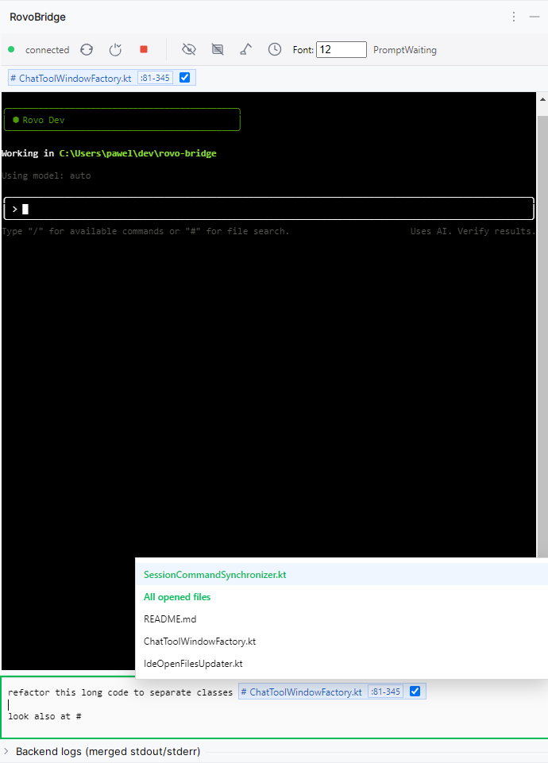

# RovoBridge

RovoBridge provides a rich graphical user interface (GUI) for the Rovo Dev CLI, seamlessly integrated into your favorite IDE. It enhances the developer experience by moving interactions out of the terminal and into a more powerful and intuitive chat-like interface.

This project contains the source code for the RovoBridge plugins for both JetBrains IDEs (like IntelliJ, WebStorm, etc.) and Visual Studio Code, as well as the shared web-based UI.

## What is RovoBridge?

At its core, RovoBridge is a GUI wrapper that acts as a bridge between your IDE and the `rovo-bridge` backend process. It replaces the need to type complex commands and file paths into a terminal with a user-friendly interface that supports:

*   A multi-line text composer for writing and editing prompts with ease.
*   Effortless context management by adding files and code snippets.
*   Seamless integration with your IDE's file system and editor.

## Features

-   **Rich Prompt Composer**: A dedicated text area for writing prompts with standard text editing features like undo/redo, and multi-line support, a significant upgrade from a standard terminal input.
-   **File & Directory Referencing**: Easily add files or entire directories to your prompt's context. They appear as "chips" in the UI.
-   **Code Snippet Referencing**: Add specific lines of code from any file directly into the context. The UI will display the file and the selected line range (e.g., `main.go:10-25`).
-   **Drag and Drop**: Simply drag files from your IDE's project explorer and drop them into the RovoBridge panel to add them to the context.
-   **Context Menu Integration**: Right-click on files or folders in the Project/Explorer view, or directly in the editor, to add them to the context or paste their path.
-   **IDE-Aware UI**: The web-based UI is aware of the files you have open in your IDE and can provide relevant suggestions.
-   **Cross-IDE Compatibility**: A unified experience across both JetBrains IDEs and Visual Studio Code, powered by a shared web UI.
-   **Configurable**: Customize the behavior of the plugin through your IDE's settings, including the underlying command to run.

## How to Use

### Keyboard shortcuts at a glance

- JetBrains (Editor context):
  - Add current file to context: Ctrl+, (Windows/Linux) or Cmd+\ (macOS)
  - Add selected lines to context: Ctrl+Shift+, (Windows/Linux) or Cmd+Shift+\ (macOS)
- VS Code (Editor context):
  - Add current file to context: Ctrl+' (Windows/Linux) or Cmd+' (macOS)
  - Add selected lines to context: Ctrl+Shift+' (Windows/Linux) or Cmd+Shift+' (macOS)

Tip: In the Editor/Composer, press Ctrl+Enter (Windows/Linux) or Cmd+Enter (macOS) to send the prompt.

### Referencing files inline with #

While typing in the Editor/Composer, you can reference files quickly by typing the # key and then starting to type a file name or path. A file picker overlay appears; select an item to insert it as a chip. The chip shows a “#” label plus the file name, and if you referenced a range it shows it as :start-end (for example: main.go:10-25). Paths are safely quoted if they contain spaces or special characters.

### Chips and context sending semantics

- Chips have a checkbox. Checked chips are included in the next prompt you send.
- After you send, any chips you checked become permanent (they won’t be re-sent automatically on subsequent prompts). You’ll see them styled as permanent.
- To re-send a permanent chip in a later prompt, click its checkbox once — it will be sent again on the next submit and then return to permanent state. Click the checkbox again to cancel re-sending and keep it permanent.
- Unchecked, non‑permanent chips are just references for your convenience — their content is not sent (but reference is included so LLM can read content if it wants) and are cleaned up after you send.
- Click a chip (outside the checkbox) to open that file/lines in your IDE.

### Terminal focus when the Editor is hidden

If you hide/collapse the Editor/Composer from the menu, keyboard input goes directly to the terminal and it behaves like a normal terminal again.

### In JetBrains IDEs (IntelliJ, WebStorm, etc.)

1.  **Open the Panel**: Open the RovoBridge tool window, usually found on the right-hand side of the IDE.
2.  **Add Context**:
    *   **From Project View**: Right-click on a file or folder and select `RovoBridge: Add to context`.
    *   **From Editor**: Right-click within an open file and select `RovoBridge: Add to context`.
    *   **Add Lines**: Select a block of code in the editor, right-click, and choose `RovoBridge: Add lines to context`.
    *   **Drag and Drop**: Drag files from the Project View directly onto the RovoBridge panel.
3.  **Compose and Run**: Write your prompt in the composer and run your command.

### In Visual Studio Code

1.  **Open the Panel**: Open the RovoBridge view from the Activity Bar (you'll see the RovoBridge icon).
2.  **Add Context**:
    *   **From Explorer**: Right-click on a file or folder and select `RovoBridge: Add to context`.
    *   **From Editor**: Right-click within an open file and select `RovoBridge: Add to context`.
    *   **Add Lines**: Select a block of code in the editor, right-click, and choose `RovoBridge: Add lines to context`.
    *   **Drag and Drop**: Drag files from the Explorer view directly onto the RovoBridge panel.
3.  **Compose and Run**: Write your prompt in the composer and run your command.

## Architecture Overview

The project is a monorepo with three main components:

-   `hosts/jetbrains-plugin/`: The Kotlin-based plugin for all JetBrains IDEs.
-   `hosts/vscode-plugin/`: The TypeScript-based extension for Visual Studio Code.
-   `web-ui/`: A shared UI built with TypeScript and Vite. It runs in a webview inside the IDE plugins and communicates with the `rovo-bridge` backend via WebSocket.

Both IDE plugins are responsible for launching and managing the `rovo-bridge` backend process and displaying the `web-ui` in a webview component. They also provide the "glue" for IDE integrations like context menus and drag-and-drop.

## Documentation

### Components
- [**Backend**](backend/README.md) - Go WebSocket server and file processing backend
- [**VSCode Extension**](hosts/vscode-plugin/README.md) - VSCode plugin with rich IDE integration
- [**JetBrains Plugin**](hosts/jetbrains-plugin/README.md) - JetBrains IDE plugin (IntelliJ, WebStorm, etc.)
- [**Web UI**](web-ui/README.md) - Shared web-based user interface
