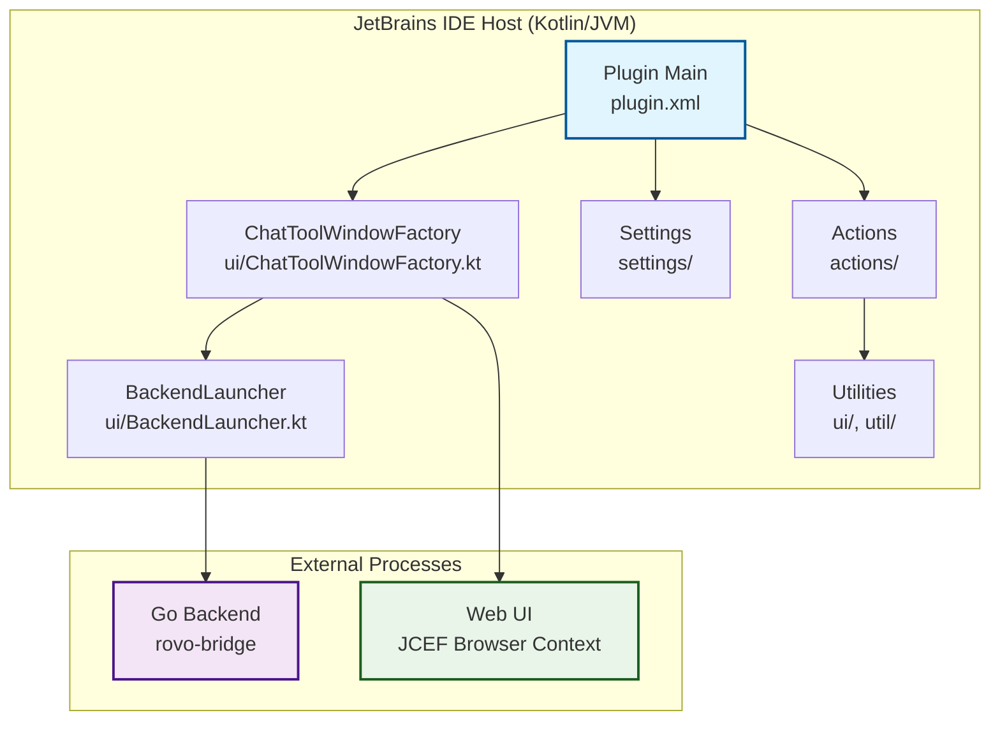
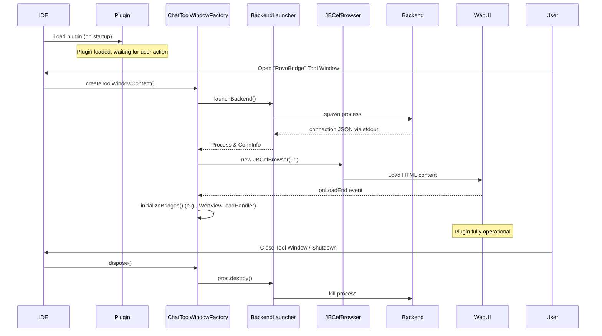
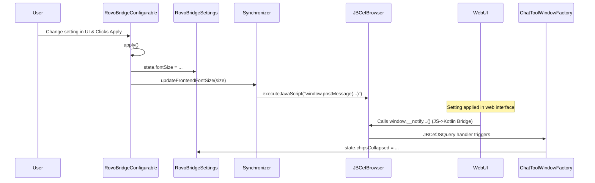
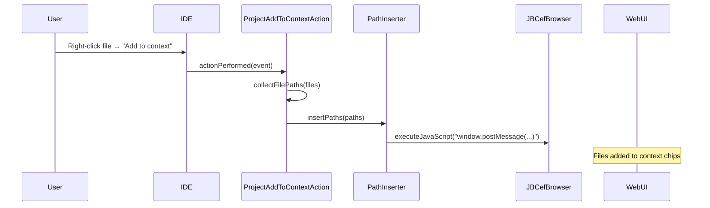
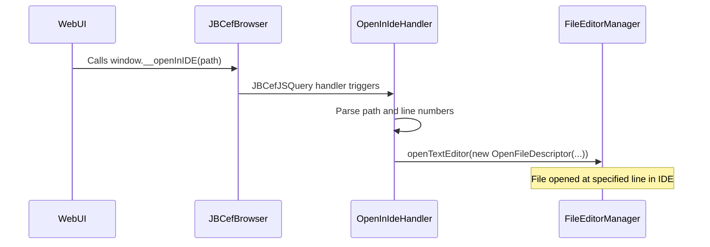
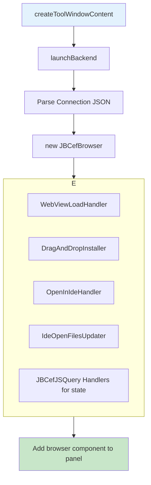
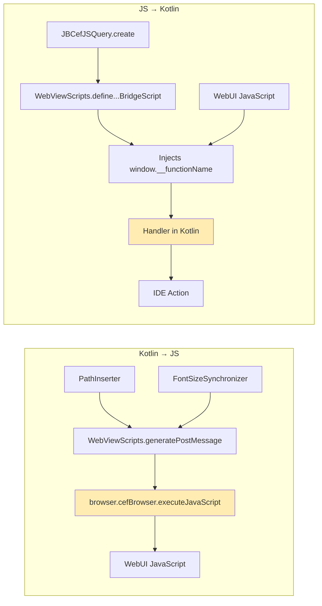
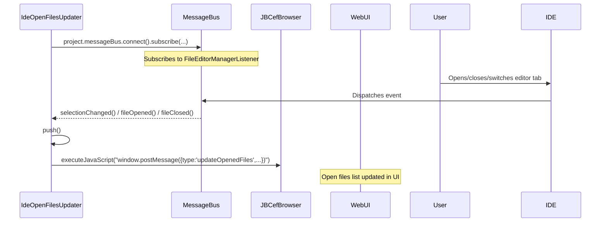
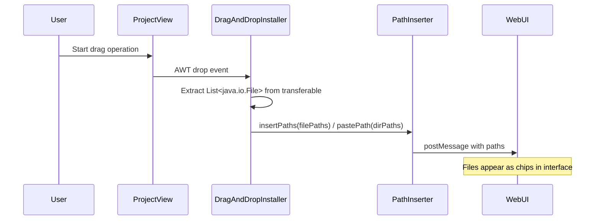

# JetBrains RovoBridge Plugin - Component Interactions

## Overview

This document provides detailed diagrams and explanations of how the various components in the JetBrains RovoBridge plugin interact. Understanding these interactions is crucial for maintaining and extending the plugin's functionality.

## High-Level Architecture



## Plugin Lifecycle Flow



## Component Communication Patterns

### 1. Settings Synchronization Flow



### 2. File Context Operations Flow



### 3. File Opening Flow (WebUI → IDE)



## Detailed Component Interactions

### BackendLauncher Component Flow

```mermaid
graph TB
    A[launchBackend] --> B[findBundledBinary]
    B --> C[util.ResourceExtractor.extractToTemp]
    C --> D[Detect OS/Architecture]
    D --> E[Copy binary from JAR to temp file]
    E --> F[Set file as executable]
    F --> G[Build command arguments]
    G --> H[Read custom command from RovoBridgeSettings]
    H --> I[new ProcessBuilder().start()]
    I --> J[Read stdout for connection JSON]
    J --> K[Setup error handling & fallback]
    K --> L[Return Process object]
    
    style A fill:#e3f2fd
    style L fill:#c8e6c9
```

### ChatToolWindowFactory Flow



### CommunicationBridge Message Flow



## Error Handling Flow

```mermaid
graph TB
    A[Component Error] --> B[try-catch block]
    B --> C[Logger.getInstance().error()]
    C --> D[Log to idea.log]
    
    B --> E{Is it a UI-blocking error?}
    E -->|Yes| F[Display error message in Tool Window panel]
    E -->|No| G[Log and continue]
    
    style A fill:#ffcdd2
    style C fill:#fff3e0
```

## File Monitoring Integration



## Drag and Drop Flow



## Resource Management and Cleanup

```mermaid
graph TB
    A[Tool Window disposed or IDE shutdown] --> B[Disposer.register(disposable)]
    B --> C[Backend Process.destroy()]
    B --> D[JBCefBrowser.dispose()]
    B --> E[Singleton.clearBrowser()]
    B --> F[MessageBus connection.disconnect()]
    
    C --> G[Backend process terminated]
    D --> H[JCEF resources released]
    E --> I[Prevents memory leaks from static refs]
    F --> J[Event listeners removed]
    
    style A fill:#ffcdd2
```

This component interaction documentation should be referenced when making architectural changes or debugging complex issues that span multiple components of the JetBrains plugin.
