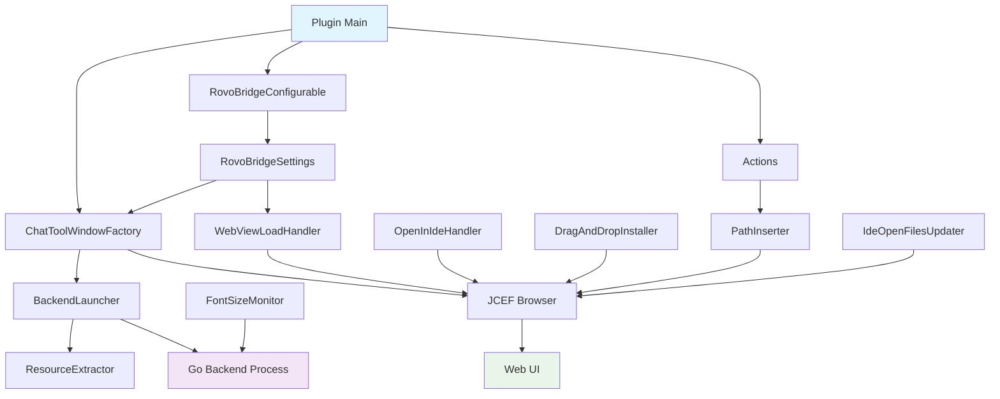

# JetBrains RovoBridge Plugin - Developer Guide

## Overview

This developer guide provides comprehensive information about the JetBrains RovoBridge plugin architecture, component interactions, and maintenance procedures. The plugin mirrors the functionality of the VSCode RovoBridge extension while adapting to the JetBrains Platform SDK architecture.

## Architecture Overview

### Component Hierarchy

```
Plugin (plugin.xml)
├── ChatToolWindowFactory (ui/)
│   ├── BackendLauncher
│   │   └── ResourceExtractor (util/)
│   ├── JCEF Browser Integration
│   ├── Communication Handlers
│   │   ├── WebViewLoadHandler
│   │   ├── OpenInIdeHandler
│   │   ├── DragAndDropInstaller
│   │   └── ...
│   └── State Persistence Queries
├── RovoBridgeConfigurable (settings/)
│   ├── RovoBridgeSettings (Persistence Service)
│   └── Settings UI (Swing)
├── Actions (actions/)
│   ├── ProjectAddToContextAction
│   ├── EditorAddToContextAction
│   └── ...
└── Utilities
    ├── PathInserter
    ├── IdeOpenFilesUpdater
    ├── FontSizeMonitor
    └── ...
```

### Component Interactions



## Core Components

### 1. Tool Window Factory (`ui/ChatToolWindowFactory.kt`)

**Purpose**: Central coordinator for all plugin components and the main UI entry point.
**VSCode Equivalent**: `extension.ts`

**Key Responsibilities**:
- Tool window creation and lifecycle management.
- Instantiates `BackendLauncher` to start the Go process.
- Creates and configures the `JBCefBrowser` component.
- Wires up all communication components (`PathInserter`, `OpenInIdeHandler`, `JBCefJSQuery` handlers, etc.).
- Manages the backend process lifecycle, terminating it when the tool window is disposed.

**Important Methods**:
```kotlin
override fun createToolWindowContent(project: Project, toolWindow: ToolWindow)
// Inside, it launches the backend, parses connection info, and sets up the browser and bridges.
```

**Maintenance Notes**:
- All components tied to the tool window's lifecycle should be registered for disposal using `Disposer.register()`.
- This is the primary location for adding new communication bridges or event listeners.

### 2. BackendLauncher (`ui/BackendLauncher.kt`)

**Purpose**: Manages the Go backend process lifecycle.
**VSCode Equivalent**: `backend/BackendLauncher.ts`

**Key Responsibilities**:
- Extracts the appropriate binary for the host OS/architecture using `ResourceExtractor`.
- Spawns the Go process with the correct arguments (`--http`, `--serve-ui`, `--print-conn-json`, etc.).
- Parses the connection info JSON from the process's stdout.
- Handles fallback logic if launching with a custom command fails.
- Manages the `PATH` environment variable for the child process.

**Important Methods**:
```kotlin
fun launchBackend(projectBasePath: String?): Process
private fun findBundledBinary(name: String): String?
private fun normalizePath(current: String?): String
```

**Maintenance Notes**:
- Update command-line arguments here if the backend changes.
- Connection timeout is hardcoded at 30 seconds.
- Ensure `rovo-bridge` binaries are correctly placed in `src/main/resources/bin/` during the build process.

### 3. Settings (`settings/`)

**Purpose**: Manages plugin configuration and the settings UI panel.
**VSCode Equivalent**: `settings/SettingsManager.ts`

- **`RovoBridgeSettings.kt`**: A `PersistentStateComponent` service that defines the settings data model (`State` class) and handles automatic persistence to `rovobridge.xml`.
- **`RovoBridgeConfigurable.kt`**: Implements the Swing-based UI for the settings panel found under `Tools > RovoBridge Plug`. It handles UI logic, validation, and applying changes to `RovoBridgeSettings`.

**Maintenance Notes**:
- To add a new setting, update the `State` data class in `RovoBridgeSettings.kt` and add the corresponding UI component and logic in `RovoBridgeConfigurable.kt`.
- For settings that need to be pushed to the web UI in real-time, call the appropriate synchronizer object (e.g., `FontSizeSynchronizer`) within the `apply()` method of `RovoBridgeConfigurable`.

### 4. Communication Bridge (Multiple Components)

**Purpose**: Facilitates bi-directional communication between the Kotlin plugin and the JavaScript Web UI.

**Key Components**:
- **Kotlin -> JS**: Achieved by executing JavaScript directly in the browser.
  - **`PathInserter.kt`**: Sends file paths from Actions to the web UI via `window.postMessage`.
  - **`FontSizeSynchronizer.kt`**, **`SessionCommandSynchronizer.kt`**: Push settings updates to the web UI.
  - **`WebViewLoadHandler.kt`**: Injects the auth token and initial UI state after the page loads.
  - **`WebViewScripts.kt`**: A helper object that generates the raw JavaScript strings for injection, keeping JS code clean and separate.
- **JS -> Kotlin**: Achieved primarily using `JBCefJSQuery`.
  - **`OpenInIdeHandler.kt`**: Installs a handler for `window.__openInIDE` (created via `JBCefJSQuery`) to allow the web UI to open files in the IDE.
  - **`ChatToolWindowFactory.kt`**: Sets up queries to persist UI state changes (e.g., collapsed panels) from the web UI back to `RovoBridgeSettings`.

**Maintenance Notes**:
- When adding a new JS-to-Kotlin call, create a `JBCefJSQuery`, inject it into the webview using `WebViewScripts`, and add a Kotlin handler for it.
- When adding a new Kotlin-to-JS call, it's best to use `window.postMessage` to follow the established message-based protocol.

## Development Workflows

### Adding New Actions

1.  **Create Action Class**:
    -   Create a new class in the `actions/` package that extends `com.intellij.openapi.actionSystem.AnAction`.
    -   Implement the `actionPerformed` method to execute the desired logic.
    -   Implement the `update` method to control the action's visibility and enabled state.
    ```kotlin
    class MyNewAction : AnAction("My New Action") {
        override fun actionPerformed(e: AnActionEvent) { /* ... */ }
        override fun update(e: AnActionEvent) { /* ... */ }
    }
    ```

2.  **Register in `plugin.xml`**:
    -   Add a new `<action>` tag inside the `<actions>` section.
    -   Specify the ID, class, and text.
    -   Add it to a UI group, like `ProjectViewPopupMenu` or `EditorPopupMenu`.
    ```xml
    <action id="my.new.action" class="paviko.rovobridge.actions.MyNewAction" text="My New Action">
      <add-to-group group-id="ProjectViewPopupMenu" anchor="last"/>
    </action>
    ```

### Adding New Settings

1.  **Update State Class**:
    -   Add the new property to the `data class State` in `settings/RovoBridgeSettings.kt`.
    ```kotlin
    data class State(
        // ... existing settings
        var newSetting: String = "default"
    )
    ```

2.  **Update Settings UI**:
    -   In `settings/RovoBridgeConfigurable.kt`, add a new Swing component for the setting.
    -   Update the `isModified`, `apply`, and `reset` methods to handle the new component's state.

3.  **Update Validation**:
    -   If validation is needed, add it in `RovoBridgeConfigurable.kt` and in the `loadState` method of `RovoBridgeSettings.kt`.

## Testing Strategy

### Unit Testing (`unitTest`)

**Location**: `src/unitTest/kotlin/`

-   These are standalone tests that run on the JVM without requiring a running IDE instance.
-   They are suitable for testing logic that does not depend on IntelliJ Platform APIs (e.g., message serialization).
-   Run with the `unitTest` Gradle task: `./gradlew unitTest`.

### Integration Testing (`test`)

**Location**: `src/test/kotlin/` (if present)

-   These tests run against a headless or full IDE instance and are suitable for testing components that interact with the IDE, like Actions and Services.
-   Run with the `test` Gradle task: `./gradlew test`.

### Manual Testing

-   The primary method of testing is running the `runIde` Gradle task and manually verifying functionality in the sandboxed IDE instance.
-   **Checklist**:
    1.  Plugin activation and tool window opening.
    2.  Backend process launch and termination.
    3.  All context menu actions and keyboard shortcuts.
    4.  Settings changes applying correctly and persisting.
    5.  Drag-and-drop functionality.
    6.  Opening a file in the IDE from the web UI.

## Error Handling

-   The plugin uses `com.intellij.openapi.diagnostic.Logger` for logging.
-   Each class typically gets its own logger instance: `private val logger = Logger.getInstance(MyClass::class.java)`.
-   Errors are logged to the IDE's log file, accessible via `Help > Show Log in...`.
-   Fatal errors related to UI creation or backend launch are displayed directly to the user in the tool window panel.
-   Extensive use of `try-catch` blocks is employed to prevent the entire plugin from crashing due to isolated errors (e.g., a single communication bridge failing).

## Performance Considerations

-   **Background Threads**: Any long-running or blocking operations (like file I/O or network calls) should be performed on a background thread using `ApplicationManager.getApplication().executeOnPooledThread()`.
-   **UI Thread**: UI updates must be dispatched to the Event Dispatch Thread (EDT) using `SwingUtilities.invokeLater()` or `ApplicationManager.getApplication().invokeLater()`.
-   **Disposables**: To prevent memory leaks, all listeners and heavy objects created within the tool window's scope must be registered with a `Disposable` parent (usually the tool window itself) so they can be garbage collected properly.

## Security Considerations

-   **Process Security**: The backend Go process is launched as a child of the IDE process. Custom commands are executed as-is, and the settings UI warns users about shell operators.
-   **Binary Extraction**: Binaries are extracted from the plugin's signed JAR to a temporary directory and made executable. This is a standard practice for shipping executables with plugins.
-   **Communication Security**: Communication with the backend is done over `localhost` and is protected by a randomly generated, single-use bearer token. The token is passed to the web UI via a `postMessage` call after the page loads to avoid exposing it in the URL.
