# VSCode RovoBridge Extension - Component Interactions

## Overview

This document provides detailed diagrams and explanations of how the various components in the VSCode RovoBridge extension interact with each other. Understanding these interactions is crucial for maintaining and extending the extension.

## High-Level Architecture

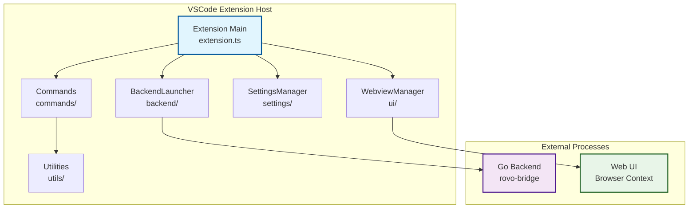

## Extension Lifecycle Flow

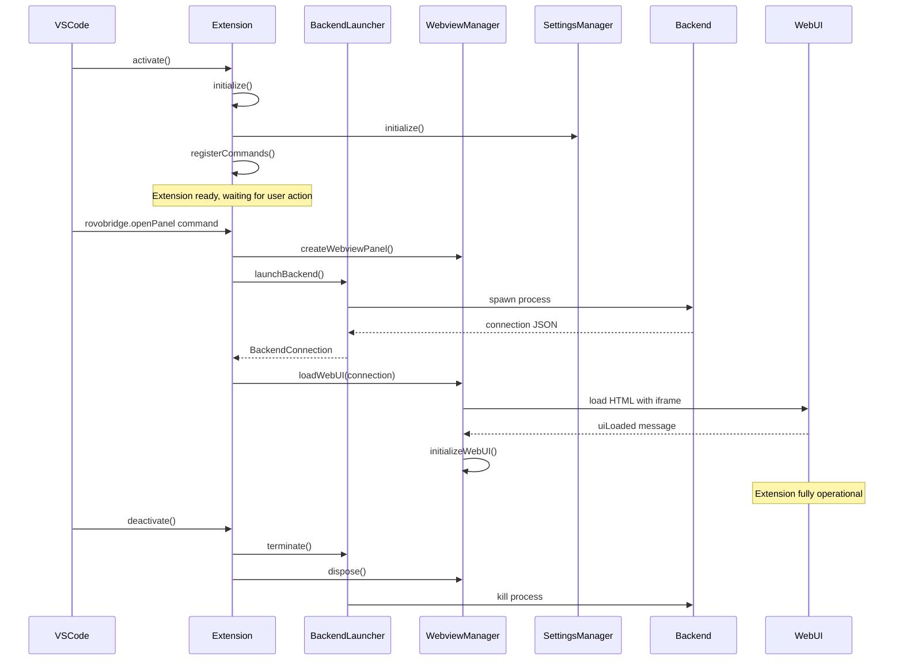

## Component Communication Patterns

### 1. Settings Synchronization Flow

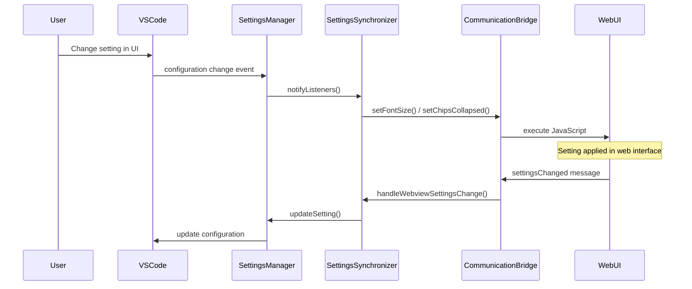

### 2. File Context Operations Flow

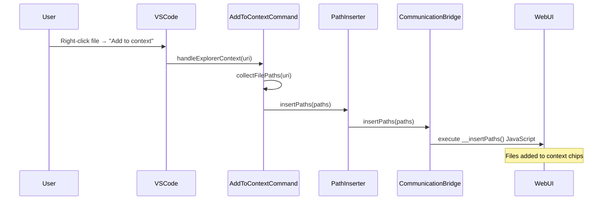

### 3. File Opening Flow (WebUI → VSCode)

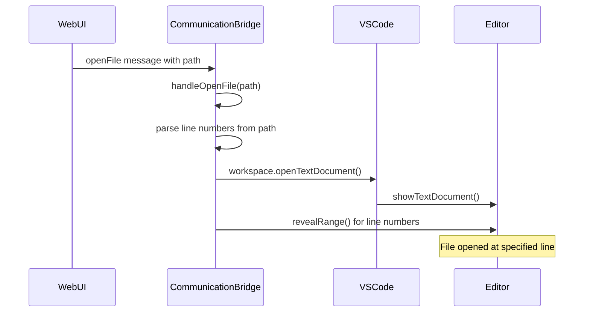

## Detailed Component Interactions

### BackendLauncher Component Flow

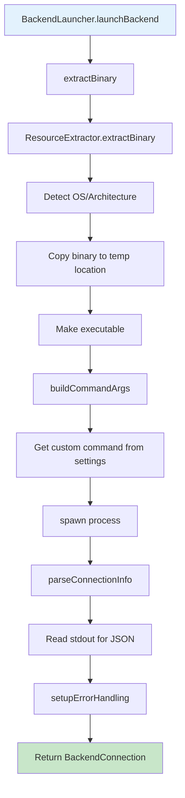

### WebviewManager Component Flow

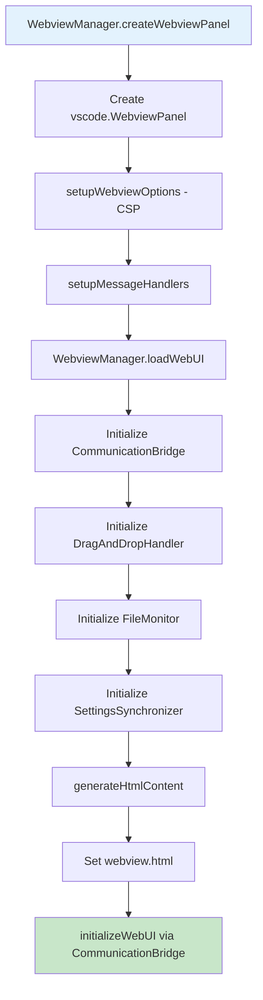

### CommunicationBridge Message Flow

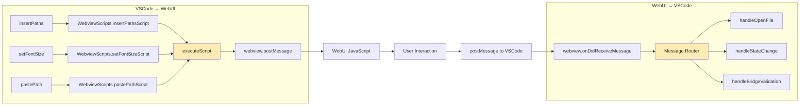

## Error Handling Flow

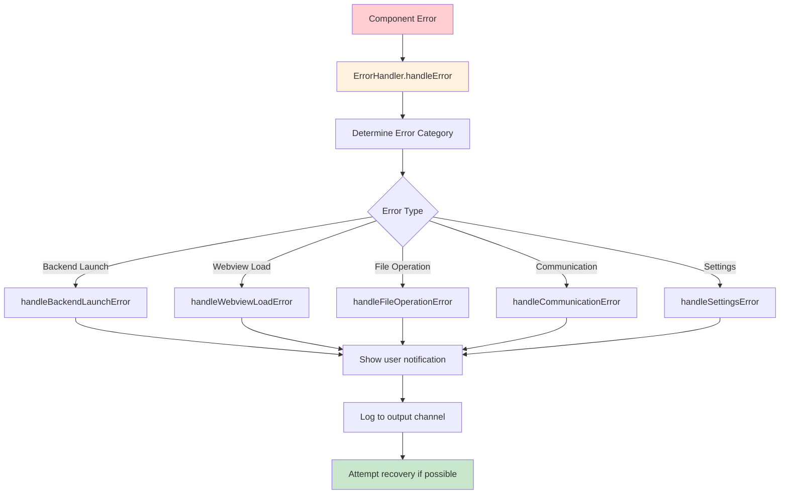

## File Monitoring Integration

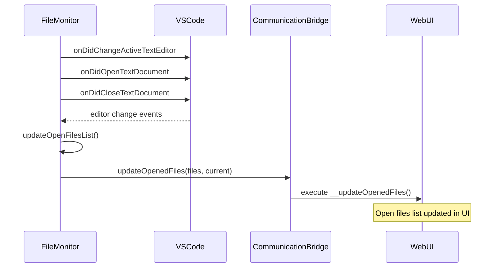

## Drag and Drop Flow

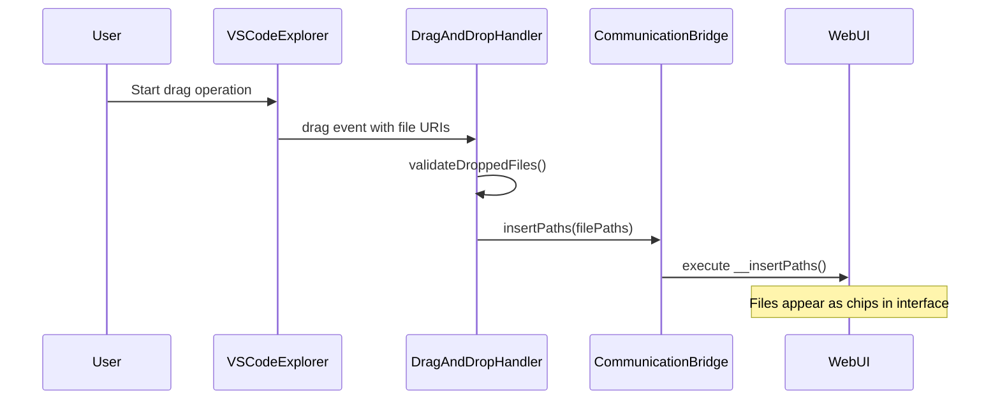

## Settings Architecture

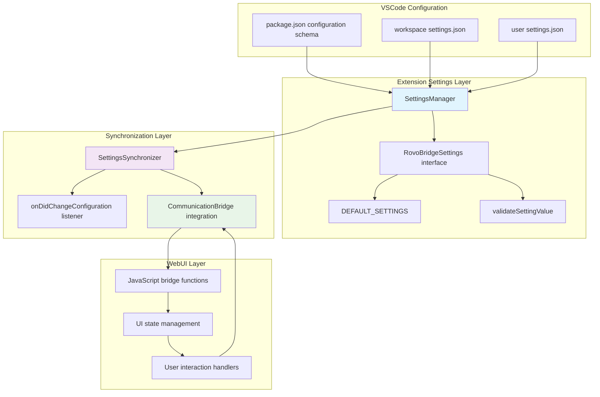

## Command Registration and Execution

```mermaid
graph TB
    subgraph "Extension Activation"
        A[extension.ts activate()] --> B[registerCommands()]
        B --> C[vscode.commands.registerCommand]
        C --> D[Add to context.subscriptions]
    end
    
    subgraph "Command Execution"
        E[User Action] --> F[VSCode Command Palette / Context Menu]
        F --> G[Command Handler in extension.ts]
        G --> H{Command Type}
        
        H -->|File Context| I[AddToContextCommand.handleExplorerContext]
        H -->|Editor Context| J[AddToContextCommand.handleEditorContext]
        H -->|Lines Context| K[AddLinesToContextCommand.handleSelectedLines]
        H -->|Paste Path| L[PastePathCommand.handleDirectoryPaste]
        H -->|Open Panel| M[handleOpenPanel]
        
        I --> N[PathInserter.insertPaths]
        J --> N
        K --> N
        L --> O[PathInserter.pastePath]
        M --> P[WebviewManager + BackendLauncher]
        
        N --> Q[CommunicationBridge]
        O --> Q
        Q --> R[WebUI]
    end
    
    style A fill:#e3f2fd
    style E fill:#fff3e0
    style R fill:#c8e6c9
```

## Resource Management and Cleanup

```mermaid
graph TB
    A[Extension Deactivation] --> B[RovoBridgeExtension.dispose()]
    B --> C[WebviewManager.dispose()]
    B --> D[BackendLauncher.terminate()]
    B --> E[SettingsManager.dispose()]
    
    C --> F[CommunicationBridge.dispose()]
    C --> G[DragAndDropHandler.dispose()]
    C --> H[FileMonitor.stopMonitoring()]
    C --> I[SettingsSynchronizer.dispose()]
    C --> J[webviewPanel.dispose()]
    
    D --> K[Process.kill('SIGTERM')]
    D --> L[Timeout → Process.kill('SIGKILL')]
    
    E --> M[configurationListener.dispose()]
    E --> N[Clear changeListeners array]
    
    F --> O[messageHandlerDisposable.dispose()]
    G --> P[Clear drag event listeners]
    H --> Q[Clear file watchers]
    I --> R[Clear settings listeners]
    
    style A fill:#ffcdd2
    style B fill:#fff3e0
    style K fill:#c8e6c9
    style L fill:#c8e6c9
```

## Key Integration Points

### 1. Extension ↔ Backend Communication
- **Protocol**: HTTP/WebSocket via localhost
- **Authentication**: Random 192-bit tokens
- **Data Format**: JSON messages
- **Security**: Loopback-only binding (127.0.0.1)

### 2. Extension ↔ WebUI Communication
- **Protocol**: VSCode webview messaging API
- **Data Format**: Structured message objects
- **Security**: Content Security Policy restrictions
- **Bridge Functions**: JavaScript injection for UI control

### 3. VSCode API Integration
- **Configuration**: `vscode.workspace.getConfiguration()`
- **Commands**: `vscode.commands.registerCommand()`
- **File System**: `vscode.workspace.fs` and `vscode.Uri`
- **UI**: `vscode.window` for notifications and editors

### 4. Cross-Component Dependencies
- **PathInserter** depends on **CommunicationBridge**
- **WebviewManager** coordinates multiple components
- **SettingsSynchronizer** bridges **SettingsManager** and **CommunicationBridge**
- **Commands** use **PathInserter** for WebUI communication

## Performance Considerations

### Initialization Sequence
1. **Synchronous**: Extension registration and basic setup
2. **Asynchronous**: Component initialization and backend launch
3. **Lazy**: WebUI loading only when panel is opened
4. **Background**: File monitoring and settings synchronization

### Resource Usage Patterns
- **Memory**: Components are disposed when not needed
- **CPU**: Background tasks are throttled and debounced
- **I/O**: File operations are batched and validated
- **Network**: Only localhost connections are used

This component interaction documentation should be referenced when making architectural changes or debugging complex issues that span multiple components.