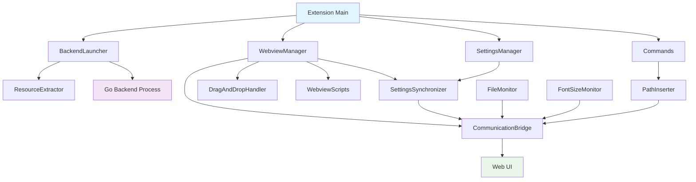

# VSCode RovoBridge Extension - Developer Guide

## Overview

This developer guide provides comprehensive information about the VSCode RovoBridge extension architecture, component interactions, and maintenance procedures. The extension mirrors the functionality of the JetBrains RovoBridge plugin while adapting to VSCode's extension architecture.

## Architecture Overview

### Component Hierarchy

```
Extension (extension.ts)
├── BackendLauncher (backend/)
│   ├── ResourceExtractor
│   └── Process Management
├── WebviewManager (ui/)
│   ├── CommunicationBridge
│   ├── DragAndDropHandler
│   ├── WebviewScripts
│   └── HTML Generation
├── SettingsManager (settings/)
│   └── SettingsSynchronizer
├── Commands (commands/)
│   ├── AddToContextCommand
│   ├── AddLinesToContextCommand
│   └── PastePathCommand
└── Utilities (utils/)
    ├── PathInserter
    ├── FileMonitor
    ├── FontSizeMonitor
    ├── ErrorHandler
    └── RecoveryUtils
```

### Component Interactions



## Core Components

### 1. Extension Main (`extension.ts`)

**Purpose**: Central coordinator for all extension components
**JetBrains Equivalent**: `ChatToolWindowFactory.kt`

**Key Responsibilities**:
- Extension lifecycle management (activation/deactivation)
- Component initialization and coordination
- Command registration
- Error handling and recovery

**Important Methods**:
```typescript
async initialize(context: vscode.ExtensionContext): Promise<void>
private registerCommands(context: vscode.ExtensionContext): void
private setupComponentCoordination(): void
```

**Maintenance Notes**:
- Always ensure proper cleanup in `dispose()` method
- Add new commands to `registerCommands()` method
- Use error handler for comprehensive error management

### 2. BackendLauncher (`backend/BackendLauncher.ts`)

**Purpose**: Manages the Go backend process lifecycle
**JetBrains Equivalent**: `BackendLauncher.kt`

**Key Responsibilities**:
- Binary extraction and OS/architecture detection
- Process spawning with correct arguments
- Connection info parsing from stdout
- Process cleanup and error handling

**Important Methods**:
```typescript
async launchBackend(workspaceRoot?: string): Promise<BackendConnection>
private extractBinary(): Promise<string>
private buildCommandArgs(binaryPath: string): string[]
private parseConnectionInfo(process: ChildProcess): Promise<BackendConnection>
```

**Maintenance Notes**:
- Update `buildCommandArgs()` when adding new backend flags
- Monitor `parseConnectionInfo()` timeout (currently 30 seconds)
- Ensure proper process cleanup in `terminate()` method

### 3. WebviewManager (`ui/WebviewManager.ts`)

**Purpose**: Manages VSCode webview panel lifecycle and content
**JetBrains Equivalent**: Webview portions of `ChatToolWindowFactory.kt`

**Key Responsibilities**:
- Webview panel creation and configuration
- HTML content generation with proper CSP
- Component coordination (bridge, drag-drop, file monitor)
- Message handling between extension and webview

**Important Methods**:
```typescript
createWebviewPanel(context: vscode.ExtensionContext, settingsManager?: SettingsManager): vscode.WebviewPanel
loadWebUI(connection: BackendConnection): void
private generateHtmlContent(uiUrl: string, token: string): string
```

**Maintenance Notes**:
- Update CSP in `setupWebviewOptions()` when adding new domains
- Modify `generateHtmlContent()` when changing webview structure
- Ensure all components are properly disposed in `cleanup()`

### 4. CommunicationBridge (`ui/CommunicationBridge.ts`)

**Purpose**: Bi-directional communication between VSCode and WebUI
**JetBrains Equivalents**: Multiple classes (`PathInserter.kt`, `FontSizeSynchronizer.kt`, etc.)

**Key Responsibilities**:
- VSCode → WebUI communication (insertPaths, setFontSize, etc.)
- WebUI → VSCode communication (openFile, settingsChanged, etc.)
- Message validation and error handling
- JavaScript bridge function management

**Important Methods**:
```typescript
// VSCode → WebUI
insertPaths(paths: string[]): void
pastePath(path: string): void
setFontSize(size: number): void
updateSessionCommand(command: string): void

// WebUI → VSCode
async handleOpenFile(path: string): Promise<void>
async handleStateChange(key: string, value: any): Promise<void>
```

**Maintenance Notes**:
- Add new bridge functions to both directions as needed
- Update `setupMessageHandlers()` when adding new message types
- Ensure proper path validation in `validatePaths()` and `normalizePath()`

### 5. SettingsManager (`settings/SettingsManager.ts`)

**Purpose**: VSCode configuration integration and management
**JetBrains Equivalents**: `RovoBridgeSettings.kt`, `RovoBridgeConfigurable.kt`

**Key Responsibilities**:
- Settings persistence and retrieval
- Real-time settings synchronization
- Validation and default value management
- Change notification system

**Important Methods**:
```typescript
getSettings(): RovoBridgeSettings
async updateSetting(key: keyof RovoBridgeSettings, value: any): Promise<void>
onSettingsChange(listener: (settings: RovoBridgeSettings) => void): vscode.Disposable
```

**Maintenance Notes**:
- Update `RovoBridgeSettings` interface when adding new settings
- Modify `DEFAULT_SETTINGS` and `validateSettingValue()` for new settings
- Ensure proper validation in `validateSettingValue()`

## Development Workflows

### Adding New Commands

1. **Create Command Handler**:
   ```typescript
   // In commands/NewCommand.ts
   export class NewCommand {
       static async handleCommand(param?: any): Promise<void> {
           // Implementation
       }
   }
   ```

2. **Register Command**:
   ```typescript
   // In extension.ts registerCommands()
   const newCommand = vscode.commands.registerCommand('rovobridge.newCommand', async (param) => {
       await this.handleNewCommand(param);
   });
   context.subscriptions.push(newCommand);
   ```

3. **Add to package.json**:
   ```json
   {
       "commands": [
           {
               "command": "rovobridge.newCommand",
               "title": "RovoBridge: New Command"
           }
       ]
   }
   ```

### Adding New Settings

1. **Update Interface**:
   ```typescript
   // In settings/SettingsManager.ts
   export interface RovoBridgeSettings {
       // ... existing settings
       newSetting: string;
   }
   ```

2. **Update Defaults**:
   ```typescript
   const DEFAULT_SETTINGS: RovoBridgeSettings = {
       // ... existing defaults
       newSetting: 'defaultValue'
   };
   ```

3. **Add Validation**:
   ```typescript
   private validateSettingValue(key: keyof RovoBridgeSettings, value: any): any {
       switch (key) {
           // ... existing cases
           case 'newSetting':
               return typeof value === 'string' ? value : DEFAULT_SETTINGS.newSetting;
       }
   }
   ```

4. **Update package.json Configuration**:
   ```json
   {
       "configuration": {
           "properties": {
               "rovobridge.newSetting": {
                   "type": "string",
                   "default": "defaultValue",
                   "description": "Description of new setting"
               }
           }
       }
   }
   ```

### Adding New Bridge Functions

1. **Add VSCode → WebUI Method**:
   ```typescript
   // In ui/CommunicationBridge.ts
   newBridgeFunction(param: string): void {
       const script = WebviewScripts.newBridgeFunctionScript(param);
       this.executeScript(script);
   }
   ```

2. **Add WebviewScripts Helper**:
   ```typescript
   // In ui/WebviewScripts.ts
   static newBridgeFunctionScript(param: string): string {
       return `
           if (typeof window.__newBridgeFunction === 'function') {
               window.__newBridgeFunction(${JSON.stringify(param)});
           }
       `;
   }
   ```

3. **Add WebUI → VSCode Handler**:
   ```typescript
   // In ui/CommunicationBridge.ts setupMessageHandlers()
   case 'newMessage':
       await this.handleNewMessage(message.data);
       break;
   ```

## Testing Strategy

### Unit Testing

**Location**: `src/test/suite/`

**Key Test Files**:
- `extension.test.ts` - Extension lifecycle and coordination
- `communicationBridge.test.ts` - Bridge functionality
- `addToContextCommand.test.ts` - Command execution
- `fileMonitor.test.ts` - File monitoring
- `fontSizeMonitor.test.ts` - Font size synchronization

**Running Tests**:
```bash
cd hosts/vscode-plugin
npm test
```

### Integration Testing

**Manual Testing Checklist**:
1. Extension activation/deactivation
2. Backend process launch and termination
3. Webview creation and loading
4. Command execution from context menus
5. Settings synchronization
6. File drag-and-drop functionality
7. Cross-platform compatibility

### Debugging

**VSCode Debug Configuration**:
```json
{
    "name": "Extension",
    "type": "extensionHost",
    "request": "launch",
    "args": ["--extensionDevelopmentPath=${workspaceFolder}/hosts/vscode-plugin"]
}
```

**Logging**:
- Each component has its own output channel
- Use `logger.appendLine()` for debugging information
- Check "RovoBridge Extension" output channels in VSCode

## Error Handling

### Error Categories

The extension uses a comprehensive error handling system with these categories:

- `BACKEND_LAUNCH` - Backend process issues
- `WEBVIEW_LOAD` - Webview loading problems
- `COMMUNICATION` - Bridge communication errors
- `FILE_OPERATION` - File system operations
- `SETTINGS` - Configuration issues
- `PERMISSION` - Access permission problems
- `NETWORK` - Network connectivity issues
- `COMMAND_EXECUTION` - Command execution failures

### Error Handler Usage

```typescript
import { errorHandler, ErrorCategory, ErrorSeverity } from '../utils/ErrorHandler';

try {
    // Risky operation
} catch (error) {
    await errorHandler.handleError(errorHandler.createErrorContext(
        ErrorCategory.FILE_OPERATION,
        ErrorSeverity.ERROR,
        'ComponentName',
        'methodName',
        error instanceof Error ? error : new Error(String(error)),
        { additionalContext: 'value' }
    ));
}
```

### Recovery Mechanisms

The extension includes automatic recovery for common issues:

- Backend process crashes → Automatic restart
- Webview load failures → Retry with fallback
- Settings corruption → Reset to defaults
- Communication errors → Graceful degradation

## Performance Considerations

### Startup Performance

- **Lazy Loading**: Components are initialized only when needed
- **Async Operations**: All I/O operations use async/await
- **Binary Caching**: Extracted binaries are cached to avoid repeated extraction

### Runtime Performance

- **Message Throttling**: Frequent operations like file list updates are debounced
- **Memory Management**: Proper cleanup of event listeners and resources
- **Background Operations**: Long-running tasks use VSCode's background task API

### Resource Usage

- **Process Monitoring**: Backend process resource usage is tracked
- **Connection Pooling**: Connections are reused where possible
- **Cleanup Scheduling**: Regular cleanup of temporary resources

## Security Considerations

### Process Security

- **Binary Verification**: Extracted binaries are validated before execution
- **Argument Sanitization**: Command injection prevention in custom commands
- **Process Isolation**: Backend runs with minimal privileges

### Communication Security

- **Token Validation**: Proper token handling for WebSocket authentication
- **Message Validation**: All messages between extension and webview are sanitized
- **Path Validation**: Directory traversal attack prevention

### Content Security Policy

The webview uses a strict CSP that only allows:
- Scripts from localhost (backend)
- Styles from localhost
- WebSocket connections to localhost
- No external resources or inline scripts (except controlled injection)

## Troubleshooting

### Common Issues

1. **Backend Won't Start**:
   - Check binary extraction permissions
   - Verify custom command syntax
   - Review backend logs in output channel

2. **Webview Won't Load**:
   - Check CSP configuration
   - Verify backend connection
   - Review webview logs

3. **Commands Not Working**:
   - Ensure webview is active
   - Check communication bridge status
   - Verify command registration

4. **Settings Not Syncing**:
   - Check settings manager initialization
   - Verify configuration permissions
   - Review settings synchronizer logs

### Diagnostic Commands

The extension provides diagnostic commands for troubleshooting:

- `rovobridge.showDiagnostics` - Show system diagnostic information
- Check output channels for detailed logs
- Use VSCode's developer tools for webview debugging

## Maintenance Tasks

### Regular Maintenance

1. **Update Dependencies**: Keep npm packages and VSCode API up to date
2. **Review Logs**: Monitor error patterns in production usage
3. **Performance Monitoring**: Track startup times and resource usage
4. **Security Updates**: Update CSP and validation logic as needed

### Version Updates

1. **Backend Compatibility**: Ensure compatibility with new backend versions
2. **VSCode API Changes**: Adapt to VSCode API deprecations and changes
3. **Settings Migration**: Handle settings schema changes gracefully
4. **Documentation Updates**: Keep documentation in sync with code changes

### Code Quality

1. **JSDoc Maintenance**: Keep documentation comments up to date
2. **Type Safety**: Maintain strict TypeScript typing
3. **Error Handling**: Ensure comprehensive error coverage
4. **Test Coverage**: Maintain and expand test coverage

## Contributing Guidelines

### Code Style

- Use TypeScript strict mode
- Follow VSCode extension conventions
- Maintain comprehensive JSDoc comments
- Use meaningful variable and method names

### Pull Request Process

1. Update JSDoc comments for any new/modified methods
2. Add or update tests for new functionality
3. Update this developer guide if architecture changes
4. Ensure all error paths are properly handled

### Documentation Requirements

- All public methods must have JSDoc comments
- Complex algorithms should have inline comments
- Architecture changes must update this guide
- New components should include usage examples

This developer guide should be updated whenever significant architectural changes are made to the extension.